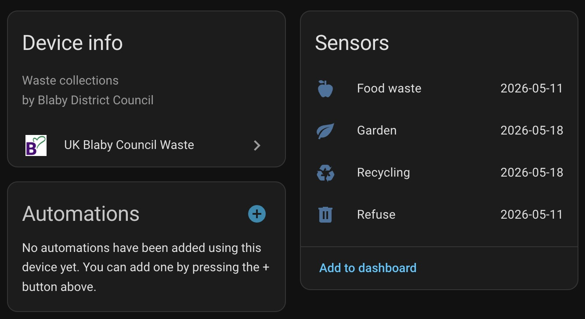

# UK Blaby Council Waste

Home Assistant custom integration for Blaby District Council waste collection dates.

This integration looks up an address from a postcode, stores the selected property in Home Assistant, and exposes upcoming bin collection dates as sensor entities.

## Features

- Config flow setup from the Home Assistant UI.
- Postcode lookup with address selection from the Blaby collections site.
- Saved postcode and location reference, so the user only configures the address once.
- One sensor per collection stream returned by the council website.
- Configurable refresh interval, with a default of once per day.
- Friendly sensor attributes for the next date, following date, collection day, and countdown values.

## What the sensors provide

The integration creates a date sensor for each waste type available at the selected property, for example:

- `Refuse`
- `Food waste`
- `Recycling`
- `Garden`

Each sensor uses the next collection date as its main state and also exposes these attributes:

- `next_date` as `d MMM yyyy`
- `following_date` as `d MMM yyyy`
- `days_until` as a display string such as `5 days`
- `days_until_count` as the raw number
- `collection_day`
- `address`

## Installation

### Manual installation

1. Copy the `custom_components/blaby_waste` folder into your Home Assistant `config/custom_components/` directory.
2. Restart Home Assistant.
3. Go to `Settings` -> `Devices & services`.
4. Choose `Add integration`.
5. Search for `UK Blaby Council Waste`.

## Setup

1. Start the integration from `Settings` -> `Devices & services` -> `Add integration`.
2. Enter your postcode, for example `LE192EL`.
3. Choose your address from the dropdown list.
4. Finish setup and allow Home Assistant to create the sensors.

## Changing the refresh interval

1. Open `Settings` -> `Devices & services`.
2. Open the `UK Blaby Council Waste` integration.
3. Choose `Configure`.
4. Set `Refresh interval (hours)`.

The default is `24`, so the collection data refreshes once a day.

## Data source

Data is retrieved from the Blaby District Council collections service:

- [Blaby collections page](https://my.blaby.gov.uk/collections)

The integration scrapes the live council pages, so if the council changes its website markup, parser updates may be required.
